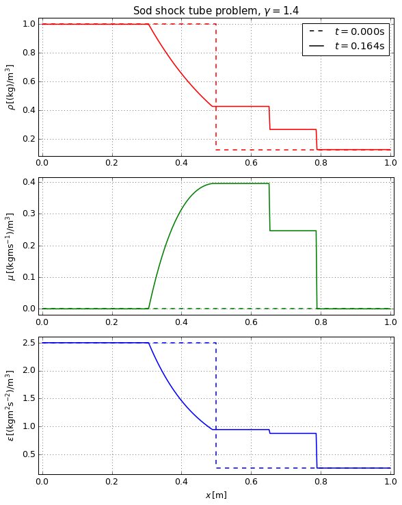

# ToroExact

ToroExact is a Python program meant to generate exact solutions to Riemann problems for the Euler equations of hydrodynamics, based on the solver of Toro [1]. By default, the seven problems used for code verification by Toro are included. Additionally, user-defined problems may be specified on the command line.

## Installation

```
git clone https://github.com/MJSteil/ToroExact.git
````

## Source structure
* **toro_exact.py:** Driver script which parses user input and calls the Riemann solver

* **exactRP.py:** File containing the *exactRP* class, which encapsulates the Riemann problem data and solution methods

* **output/:** Directory holding created data files

## Usage

```
usage: toro_exact.py [-h] -p
                     {Sod,Lax,Toro-1,Toro-2,Toro-3,Toro-4,Toro-5,Toro-6,Toro-7,all,user}
                     [-g GAMMA] [-d {zonal,nodal}] [-n NPTS] [-b BOUNDS]
                     [-l STATEL] [-r STATER] [-x X0] [-t TIME] [-name NAME]

optional arguments:
  -h, --help            show this help message and exit
  -p {Sod,Lax,Toro-1,Toro-2,Toro-3,Toro-4,Toro-5,Toro-6,Toro-7,all,user}, --problem {Sod,Lax,Toro-1,Toro-2,Toro-3,Toro-4,Toro-5,Toro-6,Toro-7,all,user}
                        select which problem to solve
  -g GAMMA, --gamma GAMMA
                        set ideal gas gamma
  -d {zonal,nodal}, --disc {zonal,nodal}
                        set discretization [zonal, nodal]
  -n NPTS, --npts NPTS  set number of evaluation points
  -b BOUNDS, --bounds BOUNDS
                        set domain boundaries

  -l STATEL, --left STATEL
                        set user left state "[dens, vel, pres]"
  -r STATER, --right STATER
                        set user right state "[dens, vel, pres]"
  -x X0, --x0 X0        set user diapgram location
  -t TIME, --time TIME  set user evaluation time
  -name NAME, --name NAME
                        problem name
```
* **-p,--problem [REQUIRED]** defines which problem(s) to evaluate. Can be used multiple times (e.g. ```-p 1 -p 4 -p user```).

* **-g,--gamma** sets the adiabatic gamma (ratio of specific heats) of the ideal gas.

* **-d,--disc** sets discretization of the output points. If *zonal*, points are located at the center of equisized zones spanning the domain. If *nodal*, points are distributed evenly on the domain, inclusive of the endpoints.

* **-n,--npts** sets the number of points (or zones) to be used in the evaluation of the exact solution.

* **-b,--bounds** sets the physical domain bounds for evaluation of the exact solution (e.g. ```-b "[-1.0,2.0]"```)

#### If ```-p user``` is used, the following must be defined:

* **-l,--left** defines the left initial state for the user-defined Riemann problem. Format is \[density,velocity,pressure\] (e.g. ```-l "[1.0,0.0,1.0]"```).

* **-r,--right** defines the right initial state for the user-defined Riemann problem. Format is \[density,velocity,pressure\] (e.g. ```-r "[0.125,0.0,0.1]"```).

* **-x,--x0** defines the physical location of the initial state discontinuity.

* **-t,--time** defines the time at which the exact solution is evaluated.

* **-name,--name** defines the name of the user problem.

## Examples

### Generate all reference problems on a 100 zone grid

```./toro_exact.py -n 100 -d zonal -p all```

### Generate solutions to only problems Toro-1 and Toro-7 using default values

```./toro_exact.py -p Toro-1 -p Toro-7```

### Generate a user-defined problem on the domain [0.0,1.0] with a nodal grid of 25 points

```./toro_exact.py -n 25 -d nodal -p user --left "[1.0,0.0,1.0]" --right "[0.125,0.0,0.1]" -b "[0.0,1.0]" -x 0.5 -t 0.2 -name "'custom'"```

### Solution of the Sod shock tube problem [2]


## Reference

[1]: E.F. Toro. *Riemann solvers and numerical methods for fluid dynamics: a practical introduction*. Springer, Berlin, New York, 2009.  
[2]: G. A. Sod, J. Comput. Phys. 27.1 (1978)  
[3]: P. D. Lax, Comm. Pure Appl. Math. 7.1 (1954)

## License
MIT License

Original work Copyright 2017 Timothy A. Handy  
Modified work Copyright 2020 Martin J. Steil

Permission is hereby granted, free of charge, to any person obtaining a copy
of this software and associated documentation files (the "Software"), to deal
in the Software without restriction, including without limitation the rights
to use, copy, modify, merge, publish, distribute, sublicense, and/or sell
copies of the Software, and to permit persons to whom the Software is
furnished to do so, subject to the following conditions:

The above copyright notice and this permission notice shall be included in all
copies or substantial portions of the Software.

THE SOFTWARE IS PROVIDED "AS IS", WITHOUT WARRANTY OF ANY KIND, EXPRESS OR
IMPLIED, INCLUDING BUT NOT LIMITED TO THE WARRANTIES OF MERCHANTABILITY,
FITNESS FOR A PARTICULAR PURPOSE AND NONINFRINGEMENT. IN NO EVENT SHALL THE
AUTHORS OR COPYRIGHT HOLDERS BE LIABLE FOR ANY CLAIM, DAMAGES OR OTHER
LIABILITY, WHETHER IN AN ACTION OF CONTRACT, TORT OR OTHERWISE, ARISING FROM,
OUT OF OR IN CONNECTION WITH THE SOFTWARE OR THE USE OR OTHER DEALINGS IN THE
SOFTWARE.
